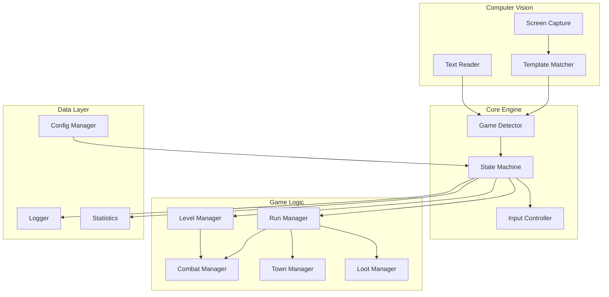
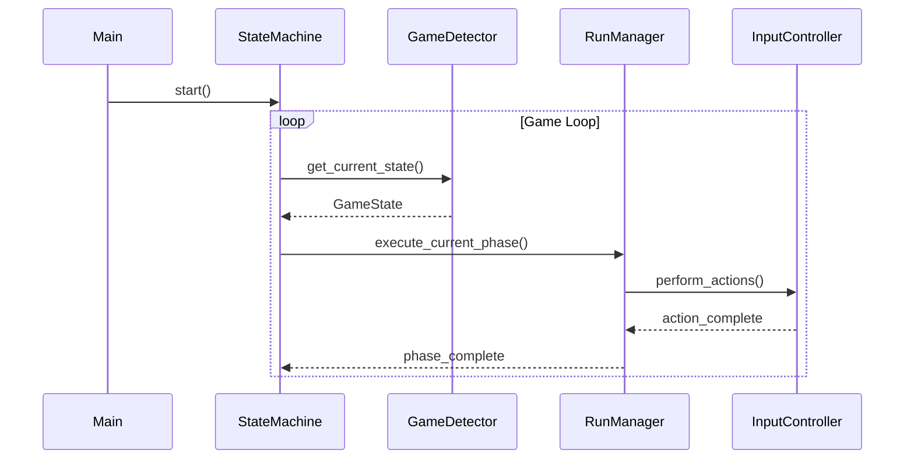
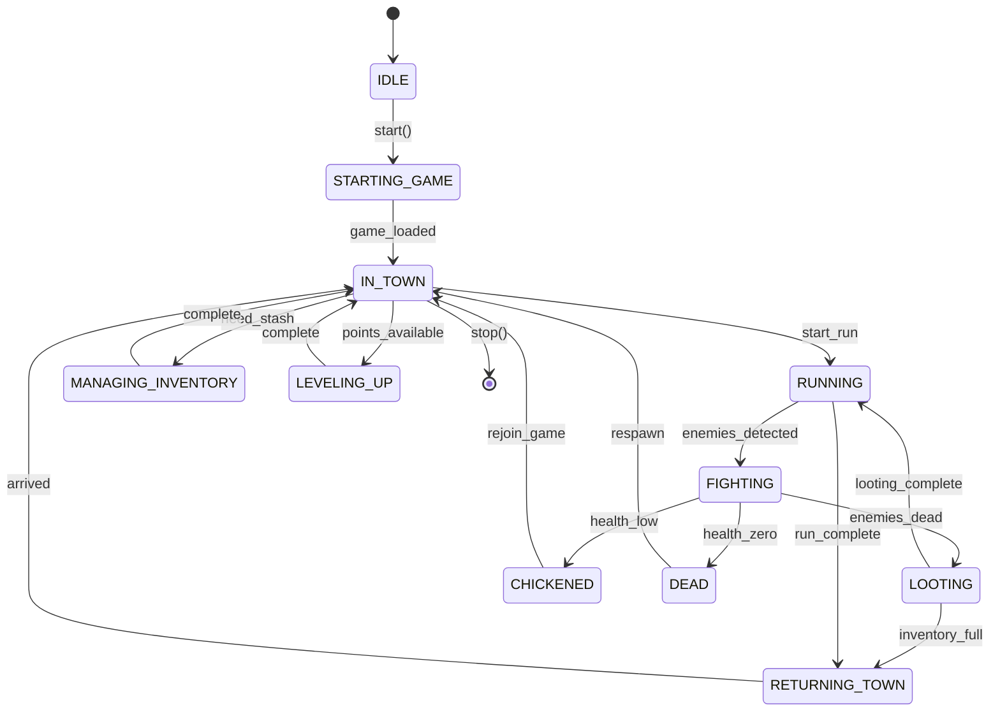
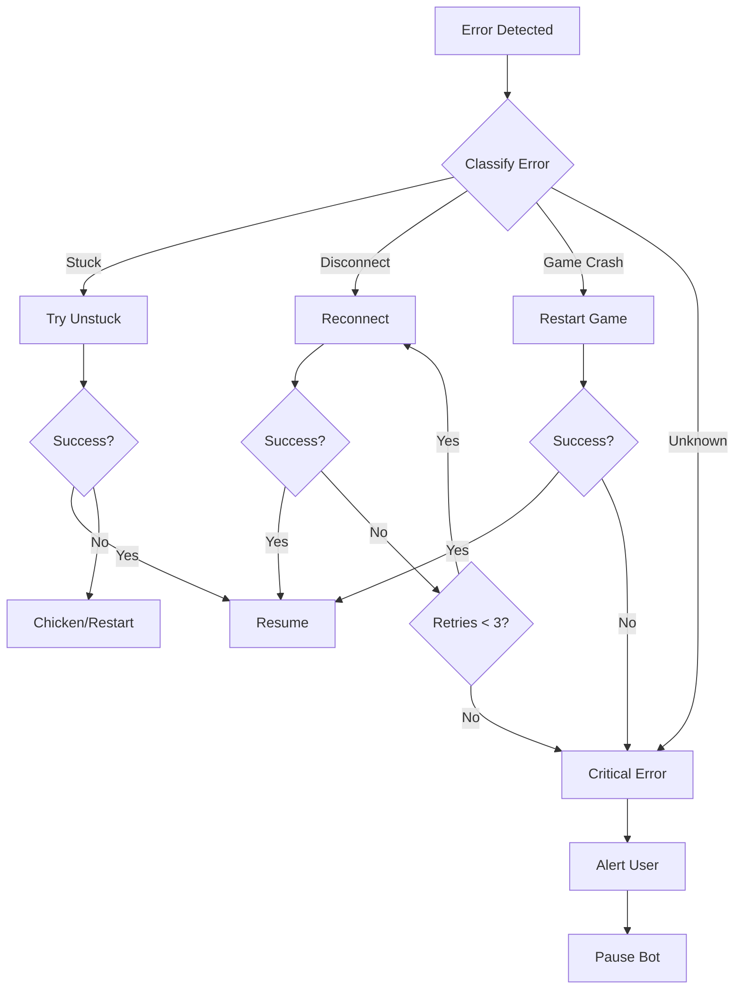

# D2R Bot - Detailed Design Document

## Overview

A Diablo II: Resurrected automation bot built with Python using computer vision (screen reading) for game state detection and input simulation for control. The bot automates farming runs and character leveling for Sorceress class.

### Goals
- Automate Pindleskin and Mephisto farming runs
- Support full leveling journey (1-75+) through all difficulties
- Provide detailed logging and run statistics
- Designed for offline (single player) first, with online compatibility

### Non-Goals (MVP)
- Multi-character support
- GUI interface (CLI only)
- Advanced NIP pickit parsing
- Multiple resolution support

---

## Detailed Requirements

### Core Functionality

| ID | Requirement | Priority |
|----|-------------|----------|
| R1 | Screen capture and game state detection | Must |
| R2 | Template matching for UI elements | Must |
| R3 | Keyboard/mouse input simulation | Must |
| R4 | Pindleskin farming run | Must |
| R5 | Mephisto farming run | Must |
| R6 | Full leveling automation (1-75) | Must |
| R7 | Predefined Sorceress build allocation | Must |
| R8 | Chicken (exit on low health) | Must |
| R9 | Loot pickup with configurable rules | Must |
| R10 | Town management (stash, repair, buy pots) | Must |

### Technical Requirements

| ID | Requirement | Details |
|----|-------------|---------|
| T1 | Language | Python 3.10+ |
| T2 | Screen capture | mss library |
| T3 | Image processing | OpenCV |
| T4 | Input simulation | pydirectinput |
| T5 | Resolution | 1920x1080 windowed |
| T6 | OS | Windows 10/11 |
| T7 | Game mode | Offline first, online compatible |

### User Experience

| ID | Requirement | Details |
|----|-------------|---------|
| U1 | CLI interface | Start, stop, configure via command line |
| U2 | Configuration files | YAML for settings and builds |
| U3 | Detailed logging | Timestamped log files |
| U4 | Run statistics | Track runs, items, deaths, times |
| U5 | Error recovery | Auto-recover from crashes/disconnects |
| U6 | Critical error handling | Pause and alert on unrecoverable errors |

---

## Architecture Overview

### High-Level Architecture



### Component Interaction Flow



---

## Components and Interfaces

### 1. Screen Capture Module

**Purpose:** Capture game screen for analysis

**Interface:**
```python
class ScreenCapture:
    def __init__(self, window_title: str = "Diablo II: Resurrected")
    def grab(self) -> np.ndarray
    def grab_region(self, region: Tuple[int, int, int, int]) -> np.ndarray
    def get_window_position(self) -> Tuple[int, int, int, int]
```

**Key Features:**
- 40ms frame caching (avoid redundant captures)
- Window-specific capture
- Region-of-interest support

---

### 2. Template Matcher Module

**Purpose:** Find UI elements and game objects in screenshots

**Interface:**
```python
class TemplateMatcher:
    def __init__(self, template_dir: str)
    def load_templates(self, category: str) -> Dict[str, np.ndarray]
    def find(self, screen: np.ndarray, template_name: str,
             threshold: float = 0.8) -> Optional[Match]
    def find_all(self, screen: np.ndarray, template_name: str,
                 threshold: float = 0.8) -> List[Match]

@dataclass
class Match:
    x: int
    y: int
    width: int
    height: int
    confidence: float
    center: Tuple[int, int]
```

**Template Categories:**
- `screens/` - Menu screens, loading, death
- `hud/` - Health orb, mana orb, belt, minimap
- `buttons/` - Menu buttons, dialog buttons
- `npcs/` - Town NPCs for interaction
- `items/` - Item bases, quality indicators
- `monsters/` - Boss templates for targeting

---

### 3. Game State Detector

**Purpose:** Determine current game state from screen

**Interface:**
```python
class GameStateDetector:
    def __init__(self, template_matcher: TemplateMatcher)
    def detect_state(self, screen: np.ndarray) -> GameState
    def get_health_percent(self, screen: np.ndarray) -> float
    def get_mana_percent(self, screen: np.ndarray) -> float
    def is_inventory_open(self, screen: np.ndarray) -> bool
    def get_player_position(self, screen: np.ndarray) -> Tuple[int, int]

class GameState(Enum):
    MAIN_MENU = "main_menu"
    CHARACTER_SELECT = "character_select"
    IN_GAME = "in_game"
    INVENTORY = "inventory"
    STASH = "stash"
    WAYPOINT = "waypoint"
    NPC_DIALOG = "npc_dialog"
    LOADING = "loading"
    DEATH = "death"
    PAUSED = "paused"
    UNKNOWN = "unknown"
```

---

### 4. Input Controller

**Purpose:** Send keyboard and mouse input to game

**Interface:**
```python
class InputController:
    def __init__(self, human_like: bool = True)

    # Mouse
    def click(self, x: int, y: int, button: str = "left")
    def move_to(self, x: int, y: int)
    def right_click(self, x: int, y: int)

    # Keyboard
    def press(self, key: str)
    def hold(self, key: str, duration: float)
    def type_text(self, text: str)

    # Skills
    def cast_skill(self, skill_key: str, target: Optional[Tuple[int, int]] = None)
    def use_potion(self, slot: int)
```

**Human-Like Features:**
- WindMouse algorithm for mouse movement
- Random timing variation (±15%)
- Gaussian-distributed delays

---

### 5. State Machine

**Purpose:** Control bot flow and state transitions

**Interface:**
```python
class BotStateMachine:
    def __init__(self, config: Config)
    def start(self)
    def stop(self)
    def pause(self)
    def resume(self)
    def get_current_state(self) -> BotState
    def transition_to(self, state: BotState)

class BotState(Enum):
    IDLE = "idle"
    STARTING_GAME = "starting_game"
    IN_TOWN = "in_town"
    RUNNING = "running"
    FIGHTING = "fighting"
    LOOTING = "looting"
    RETURNING_TOWN = "returning_town"
    MANAGING_INVENTORY = "managing_inventory"
    LEVELING_UP = "leveling_up"
    DEAD = "dead"
    CHICKENED = "chickened"
    ERROR = "error"
```

**State Transition Diagram:**



---

### 6. Run Manager

**Purpose:** Execute specific farming runs

**Interface:**
```python
class RunManager:
    def __init__(self, config: Config, input_ctrl: InputController,
                 detector: GameStateDetector)
    def execute_run(self, run_type: str) -> RunResult
    def get_available_runs(self) -> List[str]

@dataclass
class RunResult:
    run_type: str
    success: bool
    duration: float
    items_found: List[Item]
    experience_gained: int
    deaths: int
    error: Optional[str]

class PindleRun(BaseRun):
    """Pindleskin farming run."""
    def execute(self) -> RunResult

class MephistoRun(BaseRun):
    """Mephisto farming run."""
    def execute(self) -> RunResult
```

---

### 7. Combat Manager

**Purpose:** Handle combat situations

**Interface:**
```python
class CombatManager:
    def __init__(self, config: Config, input_ctrl: InputController,
                 detector: GameStateDetector)
    def engage_enemies(self, screen: np.ndarray)
    def cast_attack_skill(self, target: Tuple[int, int])
    def use_static_field(self)
    def check_health(self) -> bool  # Returns False if should chicken
    def retreat(self)

class SorceressCombat(CombatManager):
    """Sorceress-specific combat logic."""
    def cast_blizzard(self, target: Tuple[int, int])
    def cast_teleport(self, target: Tuple[int, int])
    def cast_frozen_armor(self)
```

---

### 8. Town Manager

**Purpose:** Handle town activities

**Interface:**
```python
class TownManager:
    def __init__(self, config: Config, input_ctrl: InputController)
    def go_to_stash(self)
    def stash_items(self, items: List[InventorySlot])
    def go_to_healer(self)
    def heal(self)
    def go_to_vendor(self)
    def buy_potions(self)
    def repair_gear(self)
    def use_waypoint(self, destination: str)
    def identify_items(self)
```

---

### 9. Loot Manager

**Purpose:** Handle item detection and pickup

**Interface:**
```python
class LootManager:
    def __init__(self, config: Config, input_ctrl: InputController,
                 detector: GameStateDetector)
    def scan_for_items(self, screen: np.ndarray) -> List[DetectedItem]
    def should_pickup(self, item: DetectedItem) -> bool
    def pickup_item(self, item: DetectedItem)
    def get_inventory_space(self) -> int

@dataclass
class DetectedItem:
    name: str
    quality: ItemQuality
    position: Tuple[int, int]
    base_type: str

class ItemQuality(Enum):
    NORMAL = "normal"
    MAGIC = "magic"
    RARE = "rare"
    SET = "set"
    UNIQUE = "unique"
    RUNE = "rune"
```

---

### 10. Level Manager

**Purpose:** Handle leveling and skill/stat allocation

**Interface:**
```python
class LevelManager:
    def __init__(self, config: Config, input_ctrl: InputController)
    def check_level_up(self, screen: np.ndarray) -> bool
    def allocate_stat_points(self, build: Build)
    def allocate_skill_points(self, build: Build)
    def should_respec(self, current_level: int) -> bool
    def perform_respec(self, new_build: Build)

@dataclass
class Build:
    name: str
    stat_allocation: Dict[str, int]  # str -> vit, str -> str, etc.
    skill_progression: Dict[int, List[str]]  # level -> skills
    respec_level: Optional[int]
```

---

### 11. Config Manager

**Purpose:** Load and manage configuration

**Interface:**
```python
class ConfigManager:
    def __init__(self, config_dir: str = "config")
    def load(self) -> Config
    def save(self, config: Config)
    def get_build(self, name: str) -> Build
    def get_pickit_rules(self) -> PickitRules

@dataclass
class Config:
    # General
    game_path: str
    window_title: str

    # Character
    character_name: str
    character_class: str
    build_name: str

    # Runs
    enabled_runs: List[str]
    run_count: int  # 0 for infinite

    # Safety
    chicken_health_percent: int
    chicken_mana_percent: int

    # Timing
    action_delay_ms: int
    human_like_input: bool

    # Logging
    log_level: str
    log_dir: str
    save_screenshots: bool
```

---

### 12. Statistics Tracker

**Purpose:** Track and report bot statistics

**Interface:**
```python
class StatisticsTracker:
    def __init__(self, stats_file: str)
    def record_run(self, result: RunResult)
    def record_item(self, item: DetectedItem)
    def record_death(self)
    def record_chicken(self)
    def get_session_stats(self) -> SessionStats
    def get_all_time_stats(self) -> AllTimeStats
    def export_report(self, format: str = "json") -> str

@dataclass
class SessionStats:
    start_time: datetime
    runs_completed: int
    runs_failed: int
    items_found: Dict[str, int]
    deaths: int
    chickens: int
    total_run_time: float
    average_run_time: float
    experience_gained: int
```

---

## Data Models

### Configuration Files

**config/settings.yaml**
```yaml
general:
  game_path: "C:/Program Files/Diablo II Resurrected"
  window_title: "Diablo II: Resurrected"
  resolution: [1920, 1080]

character:
  name: "BotSorc"
  class: "sorceress"
  build: "blizzard_leveling"

runs:
  enabled:
    - pindle
    - mephisto
  count: 0  # 0 = infinite
  randomize_order: true

safety:
  chicken_health: 30
  chicken_mana: 10
  max_deaths_per_run: 2

timing:
  human_like: true
  base_delay_ms: 50
  variation_percent: 15

logging:
  level: "INFO"
  directory: "logs"
  save_screenshots_on_error: true
```

**config/builds/blizzard_leveling.yaml**
```yaml
name: "Blizzard Leveling"
class: "sorceress"

phases:
  - name: "Nova Phase"
    levels: [1, 26]
    skills:
      2: charged_bolt
      3: charged_bolt
      4: charged_bolt
      6: [frost_nova, static_field]
      7: static_field
      # ... continued
    stats:
      priority: [vitality, strength]
      strength_target: 60

  - name: "Blizzard Phase"
    levels: [27, 75]
    respec_at_start: true
    skills:
      # Post-respec allocation
    stats:
      priority: [vitality]

hotkeys:
  teleport: "w"
  blizzard: "q"
  glacial_spike: "e"
  static_field: "r"
  frozen_armor: "a"
```

**config/pickit.yaml**
```yaml
always_pick:
  - quality: unique
  - quality: set
  - type: rune
  - type: charm

rare_rules:
  ring:
    min_stats:
      life_leech: 3
      magic_find: 15
  boots:
    min_stats:
      faster_run_walk: 30
      fire_resist: 20

never_pick:
  - quality: normal
    type: armor
  - quality: magic
    type: weapon
```

---

## Error Handling

### Error Categories

| Category | Examples | Recovery Action |
|----------|----------|-----------------|
| **Recoverable** | Stuck, inventory full, disconnect | Auto-recover |
| **Run-Ending** | Death, chicken | End run, start new |
| **Critical** | Game crash, unknown state | Pause, alert user |

### Recovery Strategies



### Error Handling Code Pattern

```python
class ErrorHandler:
    def __init__(self, max_retries: int = 3):
        self.max_retries = max_retries
        self.retry_count = 0

    def handle(self, error: BotError) -> ErrorResolution:
        if error.is_recoverable:
            return self.attempt_recovery(error)
        elif error.is_run_ending:
            return ErrorResolution.END_RUN
        else:
            return ErrorResolution.PAUSE_AND_ALERT

    def attempt_recovery(self, error: BotError) -> ErrorResolution:
        self.retry_count += 1
        if self.retry_count > self.max_retries:
            return ErrorResolution.PAUSE_AND_ALERT

        recovery_action = self.get_recovery_action(error)
        success = recovery_action()

        if success:
            self.retry_count = 0
            return ErrorResolution.CONTINUE
        return self.handle(error)  # Retry
```

---

## Testing Strategy

### Unit Tests

| Module | Test Focus |
|--------|------------|
| TemplateMatcher | Accuracy with known images |
| GameStateDetector | State detection accuracy |
| InputController | Action timing |
| ConfigManager | Config loading/validation |
| StatisticsTracker | Data recording accuracy |

### Integration Tests

| Test | Description |
|------|-------------|
| Screen Capture Pipeline | Capture → Template Match → State Detection |
| Input Pipeline | Action Request → Input Simulation → Verification |
| Run Execution | Full run with mock game state |

### Manual Testing Phases

1. **Offline Testing** (Safe)
   - All functionality in single player
   - No risk, full debugging

2. **Supervised Online** (Medium Risk)
   - Monitor closely
   - Test on alternate account
   - Quick intervention ready

3. **Extended Online** (Higher Risk)
   - Multi-hour runs
   - Monitor periodically

### Test Utilities

```python
class TestUtils:
    @staticmethod
    def capture_test_screenshot(name: str):
        """Capture screenshot for test data."""

    @staticmethod
    def mock_game_state(state: GameState):
        """Create mock game state for testing."""

    @staticmethod
    def simulate_run(run_type: str, mock_events: List[Event]):
        """Simulate a run with predefined events."""
```

---

## Appendices

### A. Technology Stack

| Component | Technology | Rationale |
|-----------|------------|-----------|
| Language | Python 3.10+ | Rich CV ecosystem, rapid development |
| Screen Capture | mss | 30x faster than alternatives |
| Image Processing | OpenCV | Industry standard, well documented |
| Input Simulation | pydirectinput | DirectInput works with DirectX games |
| OCR | pytesseract | Good accuracy for game text |
| Config | PyYAML | Human-readable configuration |
| CLI | click | Easy CLI development |
| Logging | loguru | Better than stdlib logging |

### B. Directory Structure

```
d2r-bot/
├── src/
│   ├── __init__.py
│   ├── main.py              # Entry point
│   ├── bot.py               # Main bot class
│   ├── state_machine.py     # State management
│   │
│   ├── vision/
│   │   ├── screen_capture.py
│   │   ├── template_matcher.py
│   │   ├── game_detector.py
│   │   └── ocr.py
│   │
│   ├── input/
│   │   ├── controller.py
│   │   ├── mouse.py         # WindMouse
│   │   └── keyboard.py
│   │
│   ├── game/
│   │   ├── runs/
│   │   │   ├── base_run.py
│   │   │   ├── pindle.py
│   │   │   └── mephisto.py
│   │   ├── combat.py
│   │   ├── town.py
│   │   ├── loot.py
│   │   └── leveling.py
│   │
│   ├── data/
│   │   ├── config.py
│   │   ├── statistics.py
│   │   └── models.py
│   │
│   └── utils/
│       ├── logger.py
│       └── helpers.py
│
├── config/
│   ├── settings.yaml
│   ├── pickit.yaml
│   └── builds/
│       └── blizzard_leveling.yaml
│
├── assets/
│   └── templates/
│       ├── screens/
│       ├── hud/
│       ├── buttons/
│       ├── npcs/
│       ├── items/
│       └── monsters/
│
├── logs/
├── stats/
├── tests/
│   ├── test_vision.py
│   ├── test_input.py
│   └── test_runs.py
│
├── requirements.txt
├── setup.py
└── README.md
```

### C. Key Research Findings Summary

1. **Botty Reference**: Primary architecture reference, proven approach
2. **mss + OpenCV**: Fast and reliable vision stack
3. **pydirectinput**: Required for DirectX game input
4. **WindMouse**: Human-like mouse movement to reduce detection
5. **Template matching threshold**: 0.8-0.9 for reliable detection
6. **NIP syntax**: Industry standard for item filtering (defer for MVP)
7. **Leveling builds**: Well-documented on maxroll.gg

### D. Risks and Mitigations

| Risk | Impact | Mitigation |
|------|--------|------------|
| Game updates break templates | High | Version templates, quick update process |
| Detection/ban (online) | High | Offline-first, human-like behavior |
| Performance issues | Medium | Optimize hot paths, cache templates |
| State detection failures | Medium | Fallback states, timeout recovery |

---

## Next Steps

After design approval:
1. Set up project structure and dependencies
2. Implement core vision pipeline
3. Implement input controller
4. Build state machine
5. Implement Pindleskin run (simplest)
6. Add town management
7. Implement Mephisto run
8. Add leveling support
9. Polish and testing
